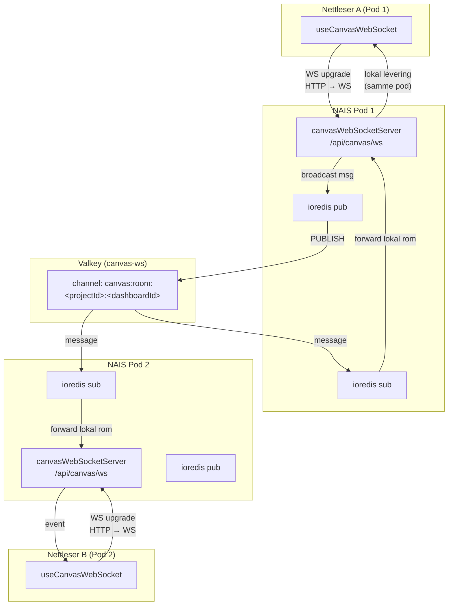

# Innblikk

Innblikk er et analyseverktøy for å måle brukeradferd, bygget av Team ResearchOps.

Spørsmål? Slack: [#researchops](https://nav-it.slack.com/archives/C02UGFS2J4B) eller opprett et issue her på GitHub.

---

## Utvikling

### 1. Opprett `.env`

```bash
cp .env.example .env
```

> `BACKEND_BASE_URL` trenger du ikke å sette — den peker automatisk mot dev-miljøet lokalt.

### 2. Installer avhengigheter

```bash
pnpm i
```

### 3. Start serveren

Serveren krever GCP-autentisering og et mock-nav-ident for lokal utvikling:

```bash
GOOGLE_APPLICATION_CREDENTIALS="$HOME/.config/gcloud/application_default_credentials.json" \
  MOCK_NAV_IDENT="Z123456" \
  pnpm run server
```

Ikke logget inn i gcloud ennå? Kjør:

```bash
gcloud auth application-default login
```

### 4. Start frontend

I et nytt terminalvindu:

```bash
pnpm run dev
```

---

## Kjøre mot lokal backend (innblikk-backend)

Vil du teste mot en lokal backend i stedet for dev-miljøet? Start backend først:

```bash
# I innblikk-backend-repoet
docker compose up                        # start databasen
./gradlew bootRun -Dspring-boot.run.profiles=local   # start Spring Boot på :8086
```

> Flyway-migrasjoner kjøres automatisk ved oppstart. Feiler migrasjonene (f.eks. etter en schemaendring),
> kjør `docker compose down -v && docker compose up` for å nullstille databasen.

Start så frontend-serveren med `BACKEND_BASE_URL` pekende mot lokal backend:

```bash
BACKEND_BASE_URL=http://localhost:8086 \
  MOCK_NAV_IDENT="Z123456" \
  pnpm run server
```

```bash
pnpm run dev
```

---

## Miljøvariabler

| Variabel                         | Påkrevd | Beskrivelse                                                     |
| -------------------------------- | ------- | --------------------------------------------------------------- |
| `GCP_PROJECT_ID`                 | Ja      | GCP-prosjekt-ID for BigQuery-spørringer                         |
| `SITEIMPROVE_BASE_URL`           | Ja      | Base URL for Siteimprove-proxyen                                |
| `BACKEND_BASE_URL`               | Nei     | Overstyrer backend-URL (standard: dev-miljøet)                  |
| `MOCK_NAV_IDENT`                 | Lokalt  | Mocker innlogget bruker (f.eks. `Z123456`)                      |
| `GOOGLE_APPLICATION_CREDENTIALS` | Lokalt  | Sti til GCP-nøkkelfil for BigQuery-tilgang                      |
| `VALKEY_URI_CANVAS_WS`           | NAIS    | Valkey-URI for canvas WS pub/sub (injiseres automatisk av NAIS) |

---

## Canvas WebSocket – arkitektur

Sanntidssamarbeid på canvas bruker WebSocket med Valkey (Redis-fork) som pub/sub-lag for å sende meldinger på tvers av pods.



**Meldingsflyt:**

1. Klient sender `{type: "join", projectId, dashboardId}` → pod abonnerer på Valkey-kanalen for rommet
2. Klient sender `{type: "broadcast", event, payload}` → pod leverer direkte til lokale klienter, publiserer til Valkey for andre pods
3. Andre pods mottar via Valkey `sub`-klient og videresender til sine lokale WS-klienter
4. Pod avabonnerer fra Valkey-kanalen når siste lokale klient forlater rommet

**Fallback:** Ingen `VALKEY_URI_CANVAS_WS` → kun in-memory (fungerer lokalt og med én pod).

### Opprette Valkey-instansen manuelt (NAIS Console)

Instansen opprettes via [console.nav.cloud.nais.io](https://console.nav.cloud.nais.io) — gjøres én gang per miljø. Bruk disse verdiene:

| Felt                   | Verdi                  |
| ---------------------- | ---------------------- |
| Instance name          | `canvas-ws`            |
| Environment            | `dev-gcp` / `prod-gcp` |
| Tier                   | `SINGLE_NODE`          |
| Memory                 | `GB_1`                 |
| Max memory policy      | `ALLKEYS_LRU`          |
| Notify keyspace events | _(tom)_                |
| Number of databases    | _(tom / standard 16)_  |

NAIS injiserer `VALKEY_URI_CANVAS_WS` automatisk i appen etter opprettelse.
