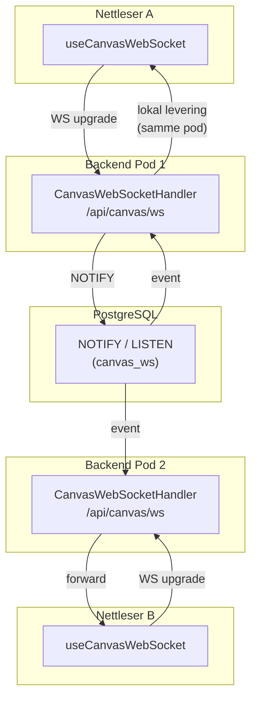

# Innblikk

Innblikk er et analyseverktøy for å måle brukeradferd, bygget av Team ResearchOps.

Spørsmål? Slack: [#researchops](https://nav-it.slack.com/archives/C02UGFS2J4B) eller opprett et issue her på GitHub.

---

## Utvikling

Det finnes to måter å kjøre appen lokalt på, avhengig av hva du skal gjøre.

### A) Bare se på/justere UI (design, PM, ingen GCP-tilgang nødvendig)

Krever kun at du er koblet til Nav sitt ansatt-nett (`*.ansatt.dev.nav.no` må være nåbart —
naisdevice/internnett er **ikke** nødvendig).

1. Be teamet (Slack: [#researchops](https://nav-it.slack.com/archives/C02UGFS2J4B)) om
   dev-backend-tokenet via en sikker kanal (delt passordvelv e.l.) — **ikke** Slack-melding i
   klartekst. Dette er et delt, dev-only, tilbakekallbart token — ikke personlig Azure AD-tilgang,
   og gir ingen tilgang utover start-umami-backend sitt dev-miljø.

2. Legg token og din egen Z-bruker i en `.env`-fil i prosjektroten:

   ```bash
   cat >> .env <<EOF
   BACKEND_TOKEN=<token fra teamet>
   MOCK_NAV_IDENT=<din egen Z-bruker>
   EOF
   ```

3. Installer avhengigheter og start alt (frontend + server) med én kommando:

   ```bash
   pnpm i
   pnpm start
   ```

Bruk din egen Z-bruker som `MOCK_NAV_IDENT` (ikke en tilfeldig placeholder) — den brukes til
visningsnavn og revisjonslogging av BigQuery-spørringer.

`BACKEND_TOKEN` er det eneste manuelle steget her; `BACKEND_BASE_URL` og `GCP_PROJECT_ID` peker
automatisk mot dev-miljøet. Prosjekt-/dashboard-/canvas-data hentes ekte fra dev-backend. De
BigQuery-baserte analysewidgetene (trafikk, funnel, retensjon osv.) og `/copilot`-chatten (som
bruker Gemini) vises med syntetiske fixture-data i stedet — se `src/server/bigquery/fixtureClient.js`
og `src/server/genai/fixtureClient.js` — siden begge krever GCP-legitimasjon du ikke trenger for
dette formålet. Fixture-dataene genereres deterministisk, så de holder seg noenlunde riktig formet
selv når spørringene/appen endres — ingen håndskrevet mock-data å vedlikeholde. `/copilot` er et
eksperimentelt Team ResearchOps-only-verktøy, men team-medlemsjekken hoppes automatisk over i
fixture-modus — du trenger ikke stå i Team-katalogen for å se hvordan funksjonen ser ut.

**Unntak fra fixture-data: nettsidelisten.** En sporingskode må peke på en ekte registrert
nettside, så dette ene oppslaget (`/api/bigquery/websites`) hentes via reops-proxy sin
bevoktede BigQuery-passthrough i stedet (samme `BACKEND_TOKEN`, se
`src/server/routes/bigquery/websiteRoutes.js`). Alt annet forblir fixture.

Du er trygg: alt kjører mot dev-miljøet (se "Dev"/"Localhost"-merket øverst i appen), ingen
handlinger her påvirker ekte brukere eller produksjonsdata, og verken BigQuery- eller
Gemini-widgetene kjører noen gang ekte spørringer/kall uten GCP-legitimasjon.

> `BACKEND_TOKEN` er validert av [innblikk-backend](https://github.com/navikt/innblikk-backend)'s
> `LocalDevTokenAuthFilter` (dev-only, never active in prod — see that file for the full
> threat-model writeup) as an alternative to the normal Azure AD OBO flow, scoped to a narrow
> allowlist of endpoints (not the full API). Samme token valideres også av reops-proxy (dev) for
> det read-only nettsideliste-oppslaget beskrevet over.

### B) Full lokal utvikling (inkludert ekte BigQuery-analyse)

Krever GCP-autentisering:

```bash
cp .env.example .env
pnpm i
gcloud auth application-default login   # hvis ikke gjort før

export GOOGLE_APPLICATION_CREDENTIALS="$HOME/.config/gcloud/application_default_credentials.json"
export MOCK_NAV_IDENT="<din egen Z-bruker>"
pnpm start
```

GCP-legitimasjon trengs kun hvis du faktisk skal endre hvordan appen snakker med
BigQuery/GCP (nye tabeller, nye spørringer, nye tjenester) — ikke for generelt design-/UI-arbeid.

---

## Kjøre mot lokal backend (innblikk-backend)

Vil du teste mot en lokal backend i stedet for dev-miljøet? Start backend først:

```bash
# I innblikk-backend-repoet
docker compose up                        # start databasen
./gradlew bootRun -Dspring-boot.run.profiles=local   # start Spring Boot på :8086
```

> Flyway-migrasjoner kjøres automatisk ved oppstart. Feiler migrasjonene (f.eks. etter en schemaendring),
> kjør `docker compose down -v && docker compose up` for å nullstille databasen.

Start så frontend-serveren med `BACKEND_BASE_URL` pekende mot lokal backend:

```bash
BACKEND_BASE_URL=http://localhost:8086 \
  MOCK_NAV_IDENT="Z123456" \
  pnpm run server
```

```bash
pnpm run dev
```

---

## Miljøvariabler

| Variabel                         | Påkrevd | Beskrivelse                                                                                                                                                 |
| -------------------------------- | ------- | ----------------------------------------------------------------------------------------------------------------------------------------------------------- |
| `GCP_PROJECT_ID`                 | Nei     | GCP-prosjekt-ID for BigQuery-spørringer (standard: dev-prosjektet lokalt)                                                                                   |
| `SITEIMPROVE_BASE_URL`           | Prod    | Base URL for Siteimprove-proxyen (ikke satt lokalt → proxyen feiler grasiøst)                                                                               |
| `BACKEND_BASE_URL`               | Nei     | Overstyrer backend-URL (standard: dev-miljøet, ansatt-nett-tilgjengelig)                                                                                    |
| `MOCK_NAV_IDENT`                 | Lokalt  | Mocker innlogget bruker — bruk din egen Z-bruker, ikke en placeholder                                                                                       |
| `GOOGLE_APPLICATION_CREDENTIALS` | Nei     | Sti til GCP-nøkkelfil. Uten denne brukes BigQuery-fixture-data lokalt                                                                                       |
| `BACKEND_TOKEN`                  | Bane A  | Delt dev-only bearer-token mot ekte dev-backend (`/api/backend/*`) og reops-proxy sitt nettsideoppslag. Hentes fra teamet via sikker kanal, aldri commitet. |
| `BIGQUERY_PROXY_BASE_URL`        | Nei     | Hvor nettsideliste-oppslaget sendes i fixture-modus (standard: `https://reops-proxy.dev.nav.no`)                                                            |

---

## Opprette/rotere `BACKEND_TOKEN` (for team-researchops)

`BACKEND_TOKEN` valideres av `LocalDevTokenAuthFilter` i
[innblikk-backend](https://github.com/navikt/innblikk-backend) og av reops-proxy (dev).
Begge leser secret `innblikk-dev-local-token` i `team-researchops` (dev-gcp).

Opprett/rotér via [Nais-konsollet](https://console.nav.cloud.nais.io/): secret
`innblikk-dev-local-token` i `dev-gcp` med key `DEV_LOCAL_AUTH_TOKEN`, verdi f.eks.
`openssl rand -hex 32`. Redeploy `start-umami-backend` og `reops-proxy` etterpå.
Del aldri tokenet i Slack/e-post/git.

Del den nye verdien via en sikker kanal (passordvelv e.l.) — aldri Slack/e-post/git. Roter ved
mistanke om lekkasje eller når noen som har hatt tokenet slutter/bytter rolle.

---

## Canvas WebSocket – arkitektur

Sanntidssamarbeid på canvas bruker WebSocket. WS-endepunktet (`/api/canvas/ws`) håndteres av [innblikk-backend](https://github.com/navikt/innblikk-backend) (Spring WebSocket). Synkronisering på tvers av pods skjer via PostgreSQL `NOTIFY/LISTEN` (`CanvasPgNotifyBridge`), ikke Valkey.



**Meldingsflyt:**

1. Klient sender `{type: "join", projectId, dashboardId}` → backend registrerer klienten i rommet
2. Klient sender `{type: "broadcast", event, payload}` → backend leverer direkte til lokale klienter og sender `NOTIFY` til PostgreSQL for andre pods
3. Andre pods mottar via `LISTEN` og videresender til sine lokale WS-klienter
4. Backend fjerner klienten fra rommet når WebSocket-tilkoblingen lukkes

**Lokal utvikling:** `vite.config.ts` proxyer `/api/canvas/ws` til backend (`ws://localhost:8081`).
